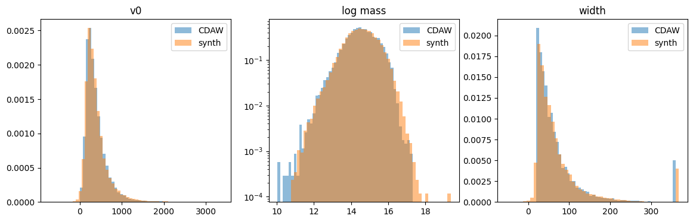
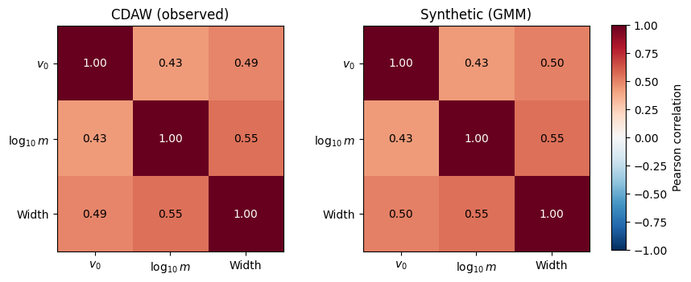
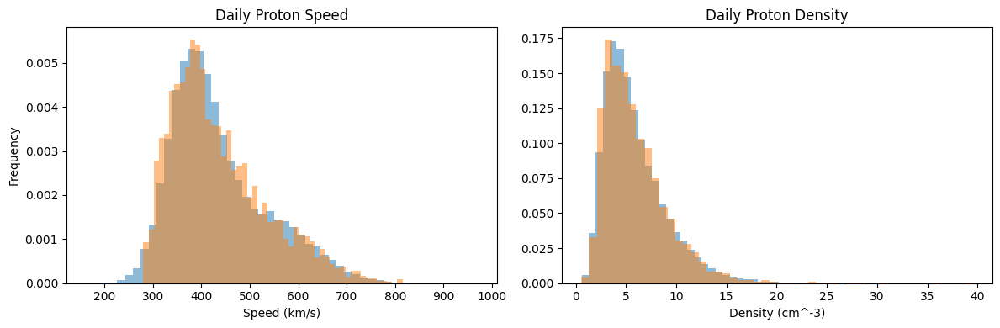
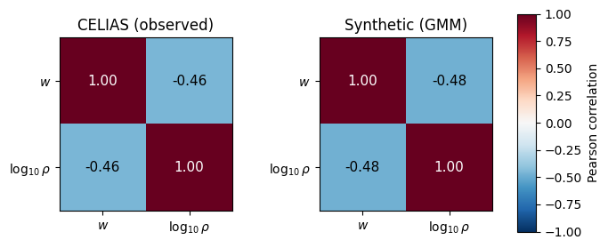
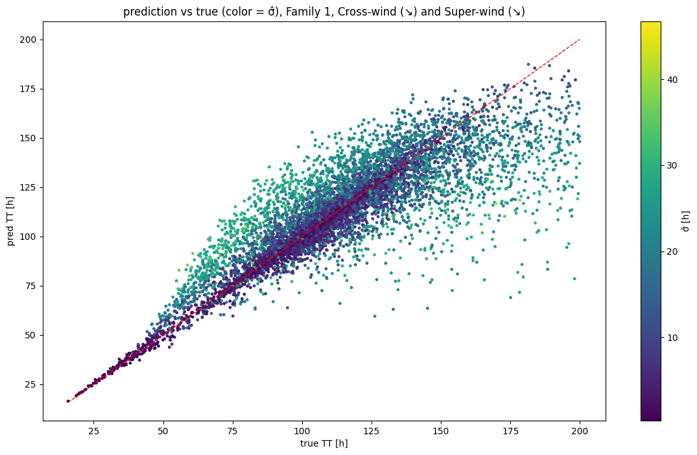
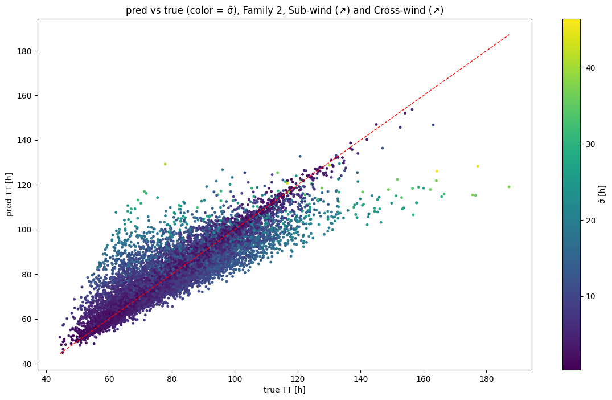

# Prediction of CME transit time

# Motivation

With the real-time detection pipeline in place, we have everything needed to predict the transit time (TT) of a CME in real time. The standard approach is to use the well-studied Drag-Based Model (DBM):
$$
\begin{aligned}
\frac{d^2r}{dt^2} &= -\gamma\left|\frac{dr}{dt} - w\right|\left(\frac{dr}{dt} - w\right) \\
&= -C\frac{A\rho}{m}\left|\frac{dr}{dt} - w\right|\left(\frac{dr}{dt} - w\right)
\end{aligned}
$$

This model was developed by Vršnak et al. (2013) to predict the transit time and arrival speed of interplanetary coronal mass ejections (ICMEs). It describes ICME propagation as aerodynamic drag between the ICME and the ambient solar wind. Here $\gamma = C\frac{A\rho}{m}$ is the drag coefficient, $A$ is the cross-sectional area of the ICME — approximated for the purposes of this work as $A = \pi \cdot \left(r_0\cdot \sin\left(\frac{wid}{2}\right)\right)^2$ — $\rho$ is the ambient solar-wind density, and $C$ is a dimensionless drag coefficient whose value is fixed to $100$ for every ICME, following Lampani et al. (2025). $m$ is the mass of the ICME, which, as explained in the preceding detection section, we compute via Thomson scattering applied to the pixel brightness of the LASCO C2 images. These parameters are sufficient to evaluate the closed-form solutions given by Vršnak et al. (2013):
$$
r(t) = \frac{S}{\gamma}\ln\left[1 + S\gamma(v_0 - w)t\right] + wt + r_0 \\
v(t) = \frac{v_0 - w}{1 + S\gamma(v_0 - w)t} + w
$$

where $v_0$ is the initial ICME speed, $r_0$ is the initial position, and $S$ is a sign factor: $S = 1$ when $v_0 > w$ and $S = -1$ when $v_0 \leq w$.

While the DBM is efficient and widely used, its single-force description has a known limitation: two CMEs with nearly identical measured characteristics can in reality produce different times of arrival (ToA) or speeds of arrival (SoA), because forces beyond pure drag act during propagation. The standard DBM assumes that a CME's motion through the heliosphere is governed solely by aerodynamic drag against the solar wind. This is a strong simplification, resting on two assumptions:

* an isotropic, radially-constant-speed solar wind,
* that drag is the only force acting on the CME once it is past the initial ballistic phase.

In reality, many CMEs experience additional accelerations or decelerations beyond pure drag — for example, residual forces from internal magnetic reconfiguration, or other non-drag effects. Observationally, this means a substantial fraction of real CME events are not well described by the DBM's assumptions: their final speed does not simply relax asymptotically toward the solar-wind speed as pure drag physics predicts. Such events are referred to as *non-DBM-compatible*, and they are common in datasets like LASCO. Lampani et al. (2025) illustrate this directly, showing that only two of the six CME propagation regimes are DBM-compatible. This is precisely the gap the Extended Drag-Based Model (EDBM) is designed to fill:
$$
\frac{d^2r}{dt^2} = -\gamma\left|\frac{dr}{dt} - w\right|\left(\frac{dr}{dt} - w\right) + a
$$

The EDBM introduces one additional unobservable parameter $a$, analogous in spirit to $C$. Physically, $a$ is a stand-in for whatever forces act on the CME besides aerodynamic drag against the solar wind — for example, residual Lorentz-force effects from internal magnetic-field reconfiguration, or other non-drag accelerations discussed in Manchester et al. (2017). Because these forces do not scale with $(\dot{r}-w)$ the way drag does, they can genuinely shift where the CME's speed settles, rather than only affecting how quickly it relaxes toward the solar wind.

The EDBM likewise admits analytical solutions for $v(t)$ and $r(t)$. Unlike the DBM, however, there is not a single expression for each: the solution depends on the propagation regime the ICME occupies. The regimes are:

| Regime | Condition | $\operatorname{sign}(a)$ | Time domain | DBM-compatible |
|---|---|---|---|---|
| Sub-wind (↗) | $v_0,v\le w,\ v_0\le v$ | $+$ (or $0$) | $[0,\,t^*_+]$ | Yes |
| Cross-wind (↗) | $v_0<w<v$ | $+$ | $(t^*_+,\,+\infty)$ | No |
| Super-wind (↗) | $v_0,v\ge w,\ v_0\le v$ | $+$ | $[0,\,+\infty)$ | No |
| Sub-wind (↘) | $v_0,v\le w,\ v_0> v$ | $-$ | $[0,\,+\infty)$ | No |
| Super-wind (↘) | $v_0,v\ge w,\ v_0> v$ | $-$ (or $0$) | $[0,\,t^*_-]$ | Yes |
| Cross-wind (↘) | $v_0>w>v$ | $-$ | $(t^*_-,\,+\infty)$ | No |

**Note.** Sub-wind (↗) and Super-wind (↘) are the two DBM-compatible regimes: they admit $a=0$, and as $a\to 0$ the corresponding formulas reduce continuously to the DBM solution (Vršnak et al. 2013). The other four regimes require $a\neq 0$. The full set of solutions can be found in Rossi et al. (2025); since we do not use all of them, we reproduce here only the ones relevant to this work.

Here
$$t^*_+ = \frac{\sigma_+}{\sqrt{a\gamma}} \quad (a>0), \qquad\qquad t^*_- = \frac{\sigma_-}{\sqrt{-a\gamma}} \quad (a<0).$$

# CME Regime analysis

Lampani et al. (2025) focus on a single regime, building a TT-prediction model for the Cross-wind (↘) case. They take the position solution
$$
r_{\text{Cross-wind (↘)}}(t) = \Big(w-\sqrt{-\dfrac{a}{\gamma}}\Big)t+r_0-\dfrac{1}{\gamma}\!\left[\ln\!\Big(\frac{e^{\,-2(\sqrt{-a\gamma}\,t-\sigma_-)}+1}{2S_-}\Big)-\sigma_-\right]
$$
and incorporate it into the model's loss function. For our purposes, however, we need to predict TT for the great majority of observed events, not a single regime. If we treat the 160 mass-bearing events from Napoletano et al. (2022) as a statistical sample, we find that the great majority are covered by four regimes — Super-wind (↘), Cross-wind (↘), Sub-wind (↗), and Cross-wind (↗) — which together account for 154 events. We can therefore expect that most observed events will fall into one of these four categories.

Does covering four regimes mean we must build four separate models? It does not. Examining the EDBM solutions reveals that, for the case $v_0 > w$, the position solution is a single piecewise function:
$$
r(t)=\begin{cases}
\displaystyle wt+r_0+\dfrac{1}{\gamma}\ln\!\big(S_-\cos(\sqrt{-a\gamma}\,t-\sigma_-)\big), & 0\le t\le t^*_- \\
\displaystyle \Big(w-\sqrt{-\dfrac{a}{\gamma}}\Big)t+r_0-\dfrac{1}{\gamma}\!\left[\ln\!\Big(\frac{e^{\,-2(\sqrt{-a\gamma}\,t-\sigma_-)}+1}{2S_-}\Big)-\sigma_-\right], & t> t^*_-
\end{cases}
$$

where
$$\sigma_- := \arctan\!\Big(\sqrt{-\dfrac{\gamma}{a}}\,(v_0-w)\Big), \qquad
S_- := \sqrt{\dfrac{a-\gamma(v_0-w)^2}{a}} \qquad (a<0).$$

The expression used by Lampani et al. (2025) is the second branch of this piecewise solution. This means that by using the full piecewise function in the loss, a single model can cover not only Cross-wind (↘) but also Super-wind (↘). Similarly, the solutions for Sub-wind (↗) and Cross-wind (↗) share a joint piecewise position solution:
$$
r(t)=\begin{cases}
\displaystyle wt+r_0-\dfrac{1}{\gamma}\ln\!\big(S_+\cos(\sqrt{a\gamma}\,t-\sigma_+)\big), & 0\le t\le t^*_+ \\
\displaystyle \Big(w-\sqrt{\dfrac{a}{\gamma}}\Big)t+r_0+\dfrac{1}{\gamma}\!\left[\ln\!\Big(\frac{e^{\,2(\sqrt{a\gamma}\,t-\sigma_+)}+1}{2S_+}\Big)+\sigma_+\right], & t> t^*_+
\end{cases}
$$

where
$$\sigma_+ := \arctan\!\Big(\sqrt{\dfrac{\gamma}{a}}\,(w-v_0)\Big), \qquad
S_+ := \sqrt{\dfrac{a+\gamma(v_0-w)^2}{a}} \qquad (a>0).$$

Thus the second-most-populated group of events is covered by a single solution as well. In total, two models suffice to cover the four most-populated regimes, each backed by enough events for the model to generalize. We refer to Cross-wind (↘) and Super-wind (↘) together as **Family 1**, and Sub-wind (↗) and Cross-wind (↗) together as **Family 2**.

# Model Architecture

We propose the following training pipeline. As in Lampani et al. (2025), we first solve for $a$ using the analytical position solution appropriate to the event's regime. We then train a model with the following architecture:

| Layer | Type | Units (in → out) | Activation |
|---|---|---|---|
| **Shared trunk** | | | |
| 1 | Linear | 5 → 64 | SiLU |
| 2 | Linear | 64 → 64 | SiLU |
| 3 | Linear | 64 → 32 | SiLU |
| **Output heads** | | | |
| Head $t$ | Linear | 32 → 1 | Softplus |
| Head $\log\sigma$ | Linear | 32 → 1 | Linear |

The model's output is not a single value but a predictive distribution — a point estimate together with an associated uncertainty. This design choice follows from experimentation and analysis of our results, in which we observed that predictions for events with shorter TT are considerably tighter than those for longer-TT events. We therefore wanted the model to act, in a sense, as a classifier as well: when the predicted TT is large, we know it may be less accurate, since a longer transit implies prolonged exposure to external effects that perturb the ICME's TT. The input layer has 5 neurons, matching our input vector $\mathbf{x} = (v_0, m, A, \rho, w)$ — the same feature set used by Lampani et al. (2025).

The model is trained with a composite loss combining a heteroscedastic data-driven term with an optional physics-informed regularization term. For each event, the network outputs a point estimate of the (scaled) travel time $\hat t_s$ together with $\log\hat\sigma_s$, the logarithm of the predicted uncertainty on that estimate. The data-driven component is the Gaussian negative log-likelihood:
$$
\mathcal{L}_{\text{data}} = \frac{1}{2}e^{-2\log \hat\sigma_s}(\hat t_s - t_s)^2 + \log \hat\sigma_s
$$

This term handles the probabilistic output of the proposed architecture: it lets the network down-weight harder-to-predict events by inflating their predicted variance, while the $\log\hat\sigma_s$ term prevents the network from trivially inflating the uncertainty to suppress the residual.

When the physics weight $\lambda_{\mathrm{phys}} > 0$, a model-driven term is added, following the strategy introduced in Guastavino et al. (2023a). The predicted travel time $\hat t$ (rescaled back to physical units) is substituted, together with the event's measured input parameters $(v_0, m, A, \rho, w)$ and the drag parameter $\gamma = CA\rho/m$ (with $C=100$ fixed), into the analytical EDBM solution $r(\hat t; a, v_0, w, \gamma)$ for the corresponding propagation regime. The resulting predicted heliocentric distance is then compared to $1\,\mathrm{AU}$:
$$
\mathcal{L}_{\text{phys}} = \frac{1}{\text{AU}^2}(r(\hat t) - \text{AU})^2
$$

The coefficient $a$ is not seen by the network; it enters only as an input to the loss function. The full loss is therefore:
$$
\mathcal{L} = \mathcal{L}_{\text{data}} + \lambda_{\text{phys}}\mathcal{L}_{\text{phys}}
$$

# Data and aggregation

Family 1 comprises 137 events and Family 2 comprises 17 events. Even 137 events is a modest sample, and 17 is far too few to train on directly. We therefore propose a strategy to address these data-starved regimes — one that ultimately enables us to improve on the 13-hour MAE reported in previous works. Napoletano et al. (2022) provide roughly 200 events, of which 164 have non-null mass, giving us 164 rows of $(m, v_0, \rho, w, A)$. Crucially, not all of these parameters are mutually dependent. We can group them by dependence: the first group is CME characteristics $(v_0, m, A)$, the second is ambient solar-wind characteristics $(w, \rho)$, and the third is $a$ on its own. This grouping lets us draw much larger samples from the CDAW catalog for the first group and from SOHO/CELIAS for the second. We then fit distributions to these data and sample thousands of synthetic rows from them.

## First group $(v_0, m, \text{width})$

For the first group we fit an 8-component Gaussian Mixture Model (GMM) with full covariance to the joint distribution of $(v_0, \log_{10} m, \mathrm{width})$ from the CDAW catalog, after standardizing each feature to zero mean and unit variance. The mass is log-transformed prior to fitting because the raw CDAW mass distribution is strongly right-skewed and spans several orders of magnitude, more consistent with a log-normal shape than a Gaussian one. Capturing $(v_0, \log_{10}m, \mathrm{width})$ jointly, rather than fitting each marginal independently, preserves the empirical correlations between CME speed, mass, and angular width observed in the catalog. Figure 1 overlays the real CDAW distributions with the synthetically generated ones, and Figure 2 shows the correlations between the three parameters $(v_0, m, \mathrm{width})$. The synthetic correlations closely match those of the real data, indicating that the distribution is well fit.

## Second group $(w, \rho)$

For the ambient solar-wind parameters, we similarly fit a GMM (3 components, full covariance) to the joint distribution of $(w, \log_{10}\rho)$ derived from in-situ CELIAS measurements, again working in log-density space to account for the heavy-tailed nature of $\rho$. Synthetic $(v_0, m, \mathrm{width})$ and $(w, \rho)$ pairs are then drawn independently from their respective fitted GMMs and combined to construct synthetic events.

## Sampling $a$

Unlike $v_0$, $m$, $\mathrm{width}$, $w$, and $\rho$, the additional EDBM acceleration $a$ is not a directly observable quantity. To characterize its distribution, we first solve for $a$ event-by-event on the subset of real CMEs with known transit time (the Family-1 sample, $v_0>w$, $a<0$): given the measured $(v_0, w, \gamma, \mathrm{TT})$ for each event, we numerically invert the EDBM travel-time equation $r(t;a)=1\,\mathrm{AU}$ for the unique value of $a$ consistent with the observed arrival, using a root-finding procedure (Brent's method) on the closed-form EDBM solution. This yields 79 individually solved values of $a$ (13 for family 2). We find that $\log_{10}|a|$ is well described by a normal distribution — equivalently, $|a|$ follows a log-normal distribution — consistent with $a$, like mass and density, being a strictly positive, multiplicative-scale physical quantity spanning several orders of magnitude. We therefore fit a log-normal distribution to the solved $|a|$ values (equivalently, a normal distribution to $\log_{10}|a|$) and use it to sample synthetic $a$ for new events, clipping sampled values to the range spanned by the solved real events to avoid extrapolating into unphysical regimes.

## Finishing the dataset

Once we have distributions for the $a$ of both families, we sample jointly from all of the fitted distributions to build a dataset of synthetic events for each family. For each event we then apply Brent's method again to find the TT corresponding to the sampled parameters $(v_0, m, A, \rho, w, a)$ by solving $r(t) = 1\,\mathrm{AU}$. This provides the $y$-label required for training.

# Pre-training

Training purely on synthetic data is not fully consistent with reality. Although the synthetic events are drawn from distributions faithful to the real values, their transit times are not real: they are produced by solving an equation that substantially simplifies ICME dynamics and rests on many assumptions. Relying on synthetic data alone would offer little advantage over simply computing the TT and SoA by root-solving the equation directly with Brent's method. We therefore use the synthetic data for pre-training and subsequently fine-tune the model on real data. Fine-tuning introduces the real-world variance back into the model. This raises the apparent error relative to the synthetic-only model, but for good reason, as shown later: the approach lets the model first learn the underlying physics from a large synthetic sample, so that comparatively few real events are then needed to capture the true dynamics — part of what the model would otherwise have to learn from real events alone has already been learned during pre-training. For Family 1 this may yield only a modest improvement, but for the severely data-starved Family 2 it helps substantially, as demonstrated further below.

## Pre-training results
On the table number 3 we can see the results of pretraining of model 1 and model 2. Family 1 as was expected is the harder family of events to predict even though the results are purely synthetic, however events here have $v_0$ above the background wind speed, and in the lower speeds, for example 700-600 km/s and lower (though still above wind speed) the transit times are, as expected, higher however the unseen acceleration coefficient $a$ has longer time span to capture many forces affecting the CME which makes it harder to expect its whereabouts and thus its TT.

| Model | MAE (h) | RMSE (h) | corr | median σ (h) | σ range (h) |
|---|---|---|---|---|---|
| Family 1 | 10.83 | 16.55 | 0.846 | 11.83 | 0.3–46.6 |
| Family 2 | 5.85 | 8.52 | 0.868 | 5.70 | 0.3–43.0 |

Although very fast CMEs $v_0 > 1000  \text{km/s}$, have higher energy, mass and density to plow through the solar wind and the interplanetary space so it is affected less and the unseend coefficient $a$ acts less upon it, making it more describable by observable parameters. We can see this phenomenon on figure number 5. Here you can also see the values colored by the uncertainty produced by the model and its heteroscedastic loss.

Family 2 is already much better even with synthetic data, this could be acredited to the fact that the neural network is learning exact solutions of the EDBM, however this also makes sense physically. Family 2 events are events with $v_0 < w$. Which results in the CME being dragged by solar wind and not being governed so much by external forces making it much more expresable by observed parameters. Than other types and families. As we will see family 2 will get most out of the pre-training as 13 events are not enough to capture this mechanisms of family 2 events. Predicted versus true transit time for the Family 2 model is shown in figure 6, also with points colored by the model's predicted uncertainty $\hat{\sigma}$ Predictions cluster tightly along the identity line (red dashed) for TT ≲ 120 h. At longer transit times the scatter broadens and the model increasingly under-predicts, regressing extreme values toward the distribution center; critically, these harder events are assigned correspondingly larger $\hat{\sigma}$ (green/yellow), confirming that the heteroscedastic head correctly identifies its own low-confidence regime.

# Fine-tuning
Fine-tuning as it has been said, is done on real data. The setup is following: in another training loop the best weights, from pre-training, are loaded. All of the weights are enabled for gradient updating. It has been tried to leave just the last two rows, however that yielded little to none difference, thus we have propmtply enabled all of the weights and are disclosing only these results.

## Model Family 1 Fine-tuning Results
In the case of Family 1 we have 79 events with valid solutions of coefficient $a$, thse events are split into train and test sets, the validation is done through k-fold validation, we are using 5 folds and 10 different seeds. The MAE is than averaged over these 10 realizations of the 5-fold training. This validation is done for multiple weights $\lambda$ of the physics part of the loss function $\mathcal{L}_{\text{phys}} = \frac{1}{\text{AU}^2}(r(\hat t) - \text{AU})^2$. We have used the following values $\lambda = \{0, 100, 500, 1000, 2000, 5000\}$. The physics term is not in the same units as the data term. Even after the scaling factor $\frac{1}{\text{AU}^2}$ the physics term is roughly 25-30x smaller than the data term, which the $\lambda$ factor fixed by fine-tuning. In the table below you can find these results:

| $\lambda_{\mathrm{phys}}$ | MAE (h) |
|---|---|
| 0 | 18.80 ± 0.29 |
| 100 | 13.24 ± 0.28 |
| 500 | 12.54 ± 0.17 |
| 1000 | 12.63 ± 0.21 |
| 2000 | 12.65 ± 0.23 |
| 5000 | 12.58 ± 0.27 |

At $\lambda_{\mathrm{phys}} = 1$ the physics gradient is negligible and the model behaves essentially as in the physics-off case ($\lambda_{\mathrm{phys}} = 0$),
which yields a poor MAE of $18.80 \pm 0.29$ h. With only 79 noisy real events
and no physical inductive bias, the network overfits the imperfect labels.
Assigning the physics term genuine authority therefore requires
$\lambda_{\mathrm{phys}}$ well above the difference in magnitudes between data and physics term ($\sim\!30$). This is justified because the EDBM constraint is the more trustworthy signal precisely in the fine-tuning regime, where the labels are real and imperfect, and because the per-event acceleration $a$ used in the term is recovered exactly from each
event's measured transit time rather than estimated. Increasing $\lambda_{\mathrm{phys}}$ improves the MAE to $12.54 \pm 0.17$ h at $\lambda_{\mathrm{phys}} = 500$, and, critically, the result is stable across an order of magnitude ($\lambda_{\mathrm{phys}} \in [500, 5000]$, all within $12.54$--$12.65$~h). This plateau, together with the absence of any degradation at large $\lambda_{\mathrm{phys}}$, confirms that the physics term is stable and reliable not just an overfitted term to fix the result values. The network is laveraging with the physics loss term that the imperfect real events are better described by real physics and that the pure data term is not enough for them.

We can compare this to pure real event training. We have also trained this model without pre-training and only on the 79 real events. Here we also used 10 seed, 5 fold validation uisng multiple lambdas. This yielded the following results:

| $\lambda_{\mathrm{phys}}$ | MAE (h) | RMSE (h) | corr | median $\hat\sigma$ (h) | $\hat\sigma$ range (h) |
|---|---|---|---|---|---|
| 0 | 14.54 ± 1.15 | 20.18 ± 2.07 | 0.381 ± 0.073 | 9.20 ± 0.48 | 0.3–26.5 |
| 100 | 37.21 ± 0.23 | 40.01 ± 0.18 | 0.498 ± 0.055 | 40.04 ± 0.47 | 22.8–74.0 |
| 500 | 38.02 ± 0.23 | 40.72 ± 0.17 | 0.513 ± 0.055 | 40.54 ± 0.78 | 25.3–89.8 |
| 1000 | 38.11 ± 0.21 | 40.80 ± 0.15 | 0.515 ± 0.053 | 40.67 ± 0.70 | 25.3–92.0 |
| 2000 | 38.14 ± 0.24 | 40.82 ± 0.16 | 0.515 ± 0.053 | 40.79 ± 0.77 | 25.6–92.5 |
| 5000 | 38.18 ± 0.24 | 40.86 ± 0.16 | 0.516 ± 0.054 | 40.86 ± 0.77 | 25.5–94.1 |

 This ablation isolates the role of synthetic pre-training by training the same architecture on the real events alone, from random initialisation. The trend is
the exact inverse of the pre-trained case: here the physics term is actively
harmful. With the physics term disabled ($\lambda_{\mathrm{phys}} = 0$) the model
attains its best MAE of $14.54 \pm 1.15$~h, whereas enabling it
($\lambda_{\mathrm{phys}} \geq 100$) degrades the MAE catastrophically to
$\sim\!38$~h, where it saturates and remains essentially flat up to
$\lambda_{\mathrm{phys}} = 5000$.
The reason is that the EDBM solution $r(t)$ is piecewise and not monotonic, so
the equation $r(\hat t) = \mathrm{AU}$ has more than one solution. Some of these
solutions sit on the wrong branch and give a $\hat t$ that is not the true
arrival time. Without pre-training the model starts from random weights, far from
the correct branch, so once the physics term dominates it pulls the predictions
into one of these wrong solutions. Pre-training fixes this: it first places the
predictions on the correct branch, and only then does the physics term help,
by fine-tuning the right solution instead of finding a wrong one. 

## Model Family 2 fine-tuning results
In the case of Family 2 events we have only 13 events for which we have a valid solution of $a$. 